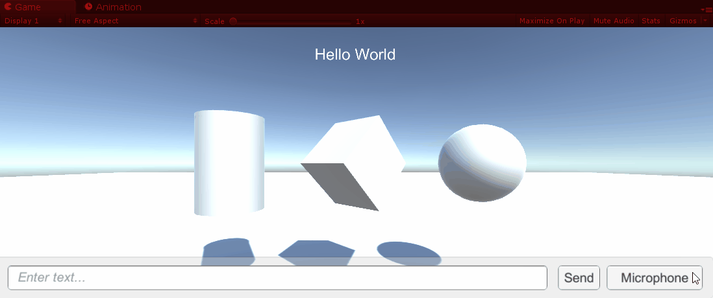

# Unity-SpeechWithLUIS
Sample Unity project used to demonstrate the integration of Speech Recognition and Language Understanding using the new [Microsoft Speech Service](https://docs.microsoft.com/en-us/azure/cognitive-services/Speech-Service/) (currently in Preview) and [LUIS](https://docs.microsoft.com/en-us/azure/cognitive-services/luis/) from Microsoft Cognitive Services. **This is a work in progress**.

* **Unity version:** 2018.2.6f1
* **Speech Service version:** 0.6.0 (Preview)

## Implementation Notes
* The [Language Understanding (LUIS)]((https://docs.microsoft.com/en-us/azure/cognitive-services/luis/)) integration work with Unity is based on a reference architecture design by my colleague [Jared Bienz](https://github.com/jbienzms). Read his articles on [Natural Language for Simulations here](http://aka.ms/mrluis). The **LUIS for XR** code is [on GitHub here](https://github.com/Microsoft/mixedreality-azure-samples/tree/master/Reference-Architecture/Client/MixedReality-Azure-Unity/Assets/MixedRealityAzure/LUIS). Follow the instructions in the second article of this series to setup your LUIS app and import the app model from the sample JSON file. 
* This sample uses the [Microsoft Speech SDK Sample for Unity](https://github.com/ActiveNick/Unity-MS-SpeechSDK). Please check that repo for specific notes about the speech support. That repo should also be considered the latest version to be used for your your own projects since I will not update this Speech-LUIS sample as often.
* You will need an Azure Cognitive Services account to use this sample: [Create an account here](https://docs.microsoft.com/azure/cognitive-services/cognitive-services-apis-create-account).
* If you see any API keys in the code, these are either trial keys that will expire soon or temporary keys that may get invalidated. Please get your own keys. [Get your own trial key to Bing Speech or the new Speech Service here](https://azure.microsoft.com/try/cognitive-services). A free tier is available allowing 5,000 transactions per month, at a rate of 20 per minute.
* For LUIS, get your API key [in the LUIS portal here](https://www.luis.ai). [The free tier](https://azure.microsoft.com/en-us/pricing/details/cognitive-services/language-understanding-intelligent-services/) allows up to 10,000 free transactions per month.

## Resource Links
* [Microsoft Cognitive Services](https://www.microsoft.com/cognitive-services) (formerly Project Oxford)
* [Language Understanding Service](https://docs.microsoft.com/en-us/azure/cognitive-services/luis/) (aka LUIS) 
* [New Cognitive Services Speech Service](https://docs.microsoft.com/en-us/azure/cognitive-services/Speech-Service/) (currently in Preview)
* [Natural Language for Simulations](http://aka.ms/mrluis), by [Jared Bienz](https://github.com/jbienzms)
* [Microsoft Speech Recognition Sample for Unity](https://github.com/ActiveNick/Unity-MS-SpeechSDK) (aka Speech-to-Text)
* [Microsoft Speech Synthesis Sample for Unity](https://github.com/ActiveNick/Unity-Text-to-Speech) (aka Text-to-Speech)

## Follow Me
* Twitter: [@ActiveNick](http://twitter.com/ActiveNick)
* SlideShare: [http://www.slideshare.net/ActiveNick](http://www.slideshare.net/ActiveNick)
